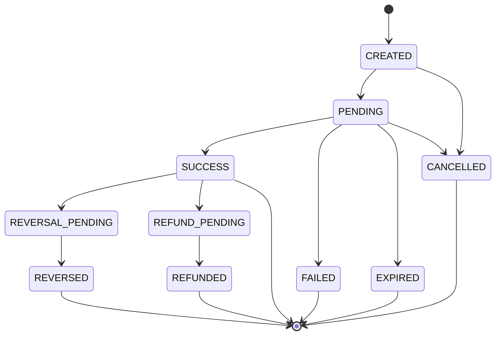
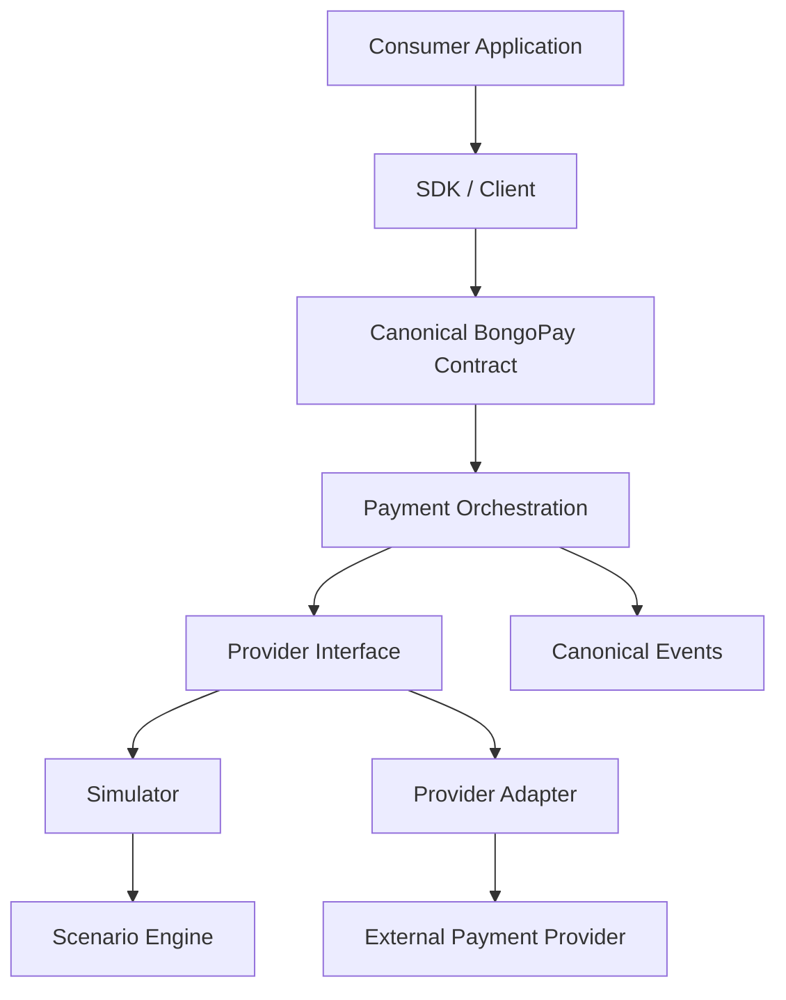

# BongoPay Architecture

This document is the architectural source of truth for BongoPay at the repository level. It
explains the philosophy, boundaries, and diagrams that every specification, contract, and
implementation must respect. Where this document and code disagree, this document — backed by
[specs/](specs/README.md) and [adr/](adr/README.md) — wins, unless an ADR has explicitly
superseded it.

## 1. Core Philosophy

BongoPay exists to answer one question the same way regardless of who implements it:

> "What is a payment, what states can it be in, and how does it get from one state to another?"

That answer must not depend on a programming language, a framework, a database, a message
broker, or a specific payment provider. It is captured as **specifications**, turned into
**contracts**, verified by **conformance tests**, and only then realized by **implementations**.

```text
Specifications
      ↓
Contracts
      ↓
Conformance Tests
      ↓
Implementations
      ↓
SDKs / Adapters
```

This is deliberately the inverse of "write the code, document it later." A change that isn't
reflected in `specs/` first is not yet part of BongoPay's architecture, no matter how many
implementations adopt it informally.

## 2. Contract-First Architecture

- **`specs/`** — Markdown specifications. Human-readable, versioned, the ultimate source of
  truth for intent and rationale. See [specs/README.md](specs/README.md).
- **`contracts/`** — Machine-readable derivations of the specs: OpenAPI, AsyncAPI, JSON Schema,
  and (where appropriate) Protocol Buffers. See [contracts/README.md](contracts/README.md).
- **`conformance/`** — Executable, language-agnostic test *definitions* that any implementation
  or adapter must satisfy. See [conformance/README.md](conformance/README.md).
- **`implementations/`** and **`adapters/`** — Code that satisfies the contracts and passes
  conformance. Implementations demonstrate the spec; they do not define it.
- **`sdks/`** — Client libraries, ideally generated from `contracts/`, that give application
  developers idiomatic access to the canonical contract per language.

If a concept doesn't exist in `specs/`, it does not exist in BongoPay yet — regardless of what
any particular implementation does internally.

## 3. Canonical Domain

The canonical domain (defined in [specs/payments/](specs/payments/README.md)) includes concepts
such as `Payment`, `PaymentRequest`, `PaymentResult`, `PaymentStatus`, `Money`, `Currency`,
`CustomerReference`, `ProviderReference`, `PaymentMethod`, `Provider`, `Metadata`, and
`ProviderOptions`. These are intentionally generic. Provider-specific concepts are only ever
attached via the namespaced `providerOptions` extension mechanism — see
[specs/providers/extensions.md](specs/providers/extensions.md) — and must never change the
meaning of a canonical field.

## 4. Payment State Machine

BongoPay defines one canonical, provider-neutral payment lifecycle. Providers map their own
statuses onto these states; canonical states never leak provider vocabulary and provider
vocabulary never leaks into the canonical core. Full detail, including valid/invalid
transitions and idempotency implications, lives in
[specs/state-machines/payment-lifecycle.md](specs/state-machines/payment-lifecycle.md).



## 5. Provider Boundary

A **provider adapter** implements a language-neutral capability contract (see
[specs/providers/adapter-contract.md](specs/providers/adapter-contract.md)): payment
initiation, status query, refund, reversal, callback parsing, and callback verification — none
of which are mandatory for every provider. Adapters declare capabilities explicitly
(capability discovery) rather than the core assuming universal support. Adapters translate
provider-specific state and errors into canonical BongoPay state and errors; they never expose
provider vocabulary through the canonical interface.

## 6. Simulator Boundary

The **simulator** is a stand-in "provider" driven by declarative, versioned
[scenarios](specs/scenarios/README.md) rather than a real network call. It exists so that the
canonical contract, orchestration logic, and conformance suite can be exercised deterministically
— including failure modes real providers rarely let you trigger on demand (timeouts, duplicate
callbacks, out-of-order events, invalid signatures). The simulator is a peer of provider adapters
behind the same Provider Interface, not a special case baked into orchestration.

## 7. SDK Boundary

SDKs are thin, idiomatic, per-language clients over the canonical contract, generated from
`contracts/` wherever practical. SDKs must not encode business logic or provider-specific
behavior beyond what the canonical contract and provider capability discovery already expose.

## 8. Reference Implementation Boundary

`implementations/reference/` demonstrates the specification working end-to-end. It is
explicitly **not** the architectural authority:

> The reference implementation demonstrates the BongoPay specification. It does not define the
> specification.

Its implementation language is an open decision (see [ADR process](adr/README.md)) and must not
constrain the language neutrality of `specs/` or `contracts/`.

## 9. Conformance Testing

Conformance tests are the mechanism that keeps "language-neutral" honest. The same conceptual
test — e.g., "duplicate callbacks must not create duplicate canonical events" — must be
expressible against any implementation or adapter, in any language. See
[conformance/README.md](conformance/README.md) for the philosophy and current scope
(specification-only; executable harnesses are a Phase 1+ concern).

## 10. Versioning

Project releases, REST APIs, event schemas, provider adapter contracts, scenario
specifications, and SDKs are versioned independently. See [VERSIONING.md](VERSIONING.md) for
what constitutes a patch, minor, or breaking change per artifact type.

## 11. Extension Points

- **Provider options** (`providerOptions.<provider>`) — namespaced, schema-validated,
  never required for unrelated providers. See
  [specs/providers/extensions.md](specs/providers/extensions.md).
- **Scenario behaviors** — new simulated failure modes are added to the scenario spec without
  changing the canonical payment contract.
- **Events** — new event types can be added additively; existing event payloads follow the
  compatibility rules in [specs/compatibility/](specs/compatibility/README.md).

## 12. Security Boundaries

Security-relevant boundaries — webhook signature verification, callback URL validation,
idempotency-key handling, and secret handling — are treated as part of the canonical contract,
not an implementation afterthought. See [SECURITY.md](SECURITY.md) for the current threat
categories under consideration and [specs/errors/README.md](specs/errors/README.md) for how
security-relevant failures are modeled as canonical errors.

## 13. Logical Architecture Diagram

This is **logical** architecture — it describes responsibility boundaries, not a required
deployment topology. A conforming implementation may colocate several of these boxes in one
process, especially early on.



## 14. What This Document Does Not Decide

The following are intentionally left open and tracked as TODOs, to be resolved via ADR/RFC as
the project matures (see [ROADMAP.md](ROADMAP.md)):

- TODO(ADR): Reference implementation language.
- TODO(ADR): Persistence architecture for a stateful reference implementation.
- TODO(ADR): Event transport/broker choice for a deployable (non-embedded) implementation.
- TODO(RFC): Long-term plugin/runtime model for community-contributed provider adapters.
- TODO(RFC): SDK generation pipeline and target languages for v1.
