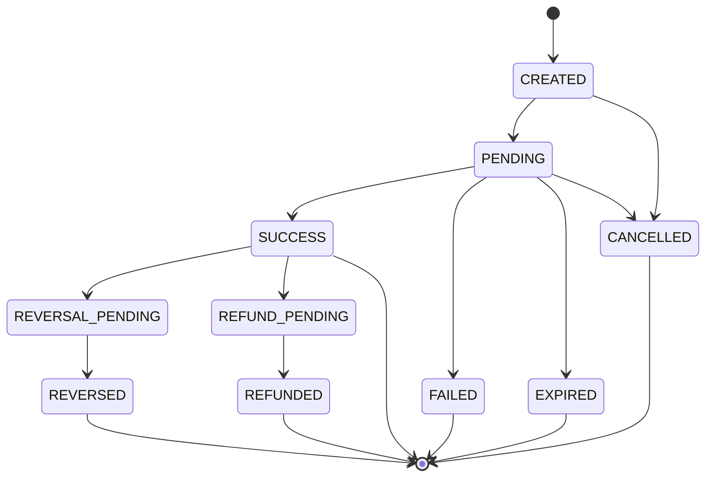

# Payment Lifecycle (Canonical State Machine)

Status: **Draft**. Version: `0.1.0` (see
[specs/compatibility/README.md](../compatibility/README.md) for what "draft" means for
compatibility purposes).

This document defines the canonical, provider-neutral `PaymentStatus` values referenced from
[specs/payments/payment-contract.md](../payments/payment-contract.md) and the valid transitions
between them. Provider-specific statuses are never valid `PaymentStatus` values — an adapter
must map its provider's vocabulary onto this state graph (see
[specs/providers/adapter-contract.md](../providers/adapter-contract.md)); a status this document
doesn't define does not exist in BongoPay.

## States

| State | Terminal? | Meaning |
|---|---|---|
| `CREATED` | No | The `Payment` exists canonically but has not yet been submitted to a provider (or the simulator). |
| `PENDING` | No | The payment has been submitted and a provider is processing it; outcome not yet known. |
| `SUCCESS` | No* | The provider confirmed the payment completed. Terminal for the original payment flow, but may transition further via refund/reversal (see below). |
| `FAILED` | Yes | The provider confirmed the payment did not complete and will not be retried automatically. |
| `EXPIRED` | Yes | The payment was not completed within its allowed window (provider timeout, customer inaction) and is no longer actionable. |
| `CANCELLED` | Yes | The payment was cancelled before reaching a terminal provider outcome — either by the caller or before submission. |
| `REVERSAL_PENDING` | No | A reversal of a `SUCCESS` payment has been requested and is in flight. |
| `REVERSED` | Yes | The reversal completed; funds movement has been undone. |
| `REFUND_PENDING` | No | A refund of a `SUCCESS` payment has been requested and is in flight. |
| `REFUNDED` | Yes | The refund completed. |

\* `SUCCESS` is terminal for the initiation flow but is a valid starting point for the
refund/reversal sub-flows below — see
[specs/payments/payment-contract.md](../payments/payment-contract.md) `PaymentResult`
TODO(spec) on whether these need a distinct result shape.

## Valid Transitions

(This is the same diagram as [ARCHITECTURE.md §4](../../ARCHITECTURE.md#4-payment-state-machine);
this document is the authoritative source for it — if the two ever disagree, this one wins and
ARCHITECTURE.md should be corrected to match.)

Any transition not drawn above is invalid. In particular:

- No transition moves backward toward `CREATED` or `PENDING` once a payment has reached
  `SUCCESS`, `FAILED`, `EXPIRED`, or `CANCELLED` — a new attempt is a new `Payment` with a new
  `idempotencyKey`, never a reuse of an existing one's state.
- `REVERSAL_PENDING` and `REFUND_PENDING` are only reachable from `SUCCESS` — refunding or
  reversing a payment that never succeeded is invalid by definition.
- TODO(spec): whether a payment can be *both* reversed and refunded (presumably mutually
  exclusive per successful payment) — open until Phase 5 (see [ROADMAP.md](../../ROADMAP.md)).

## Idempotency and Retries

- Applying an event that would cause an invalid transition (e.g. a duplicate "success" callback
  after a payment is already `SUCCESS`) MUST be a no-op with respect to canonical state — it
  must not raise the payment into a new state, re-emit a duplicate success event, or error the
  caller. See [specs/events/README.md](../events/README.md) on duplicate delivery and
  [specs/errors/README.md](../errors/README.md) for how a genuinely conflicting update (e.g. a
  callback claiming `FAILED` for a payment already `SUCCESS`) is modeled as a canonical error
  rather than silently applied.
- Retrying a `PaymentRequest` with the same `idempotencyKey` while the underlying `Payment` is
  still `CREATED` or `PENDING` MUST return the existing payment's current state, not create a
  second provider-side attempt (see
  [specs/payments/payment-contract.md](../payments/payment-contract.md) "Idempotency").

## Callback and Event Implications

Every transition above is expected to emit a corresponding canonical event (see
[specs/events/README.md](../events/README.md)) — the state machine here defines *what* the
valid transitions are; the event spec defines *how* they're observed by consumers.

## Open TODOs

- TODO(ADR): whether `REVERSAL_PENDING`/`REFUND_PENDING` need their own timeout-to-`FAILED`-like
  terminal path, analogous to `PENDING → EXPIRED`, or whether they can only ever resolve to
  `REVERSED`/`REFUNDED`.
- TODO(spec): mutual exclusivity of reversal vs. refund per payment (see above).
